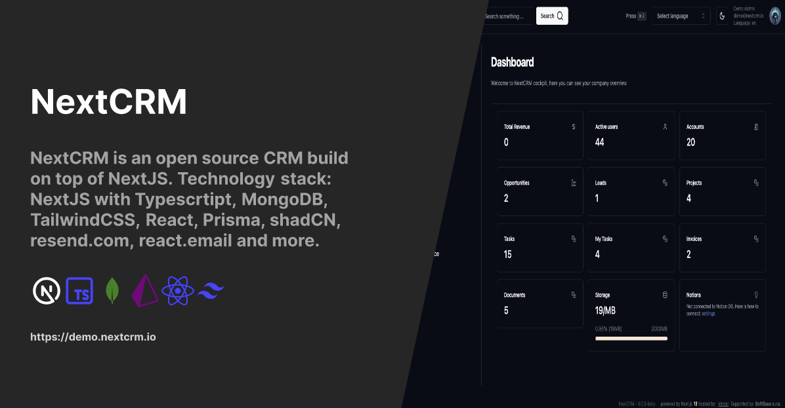

<a href="https://nextcrm.app/">
  <h1 align="center">NextCRM</h1>
</a>

<p align="center">

</p>

<!-- <p align="center">
NextCRM is a CRM build on top of the Next.JS 14 using TypeScript, great UI library shadcn, Prisma and MongoDB as a database. Upload things as a S3 blob for document storage.
</p> -->

<p align="center">
<a href="https://twitter.com/nextcrmapp">

</a>
  <a href="https://github.com/pdovhomilja/nextcrm-app/blob/main/LICENSE">
    
  </a>
</p>

<p align="center">
   <a href="#online-demo"><strong>Introduction</strong></a> ·
   <a href="#tech-stack--features"><strong>Tech Stack + Features</strong></a> ·
   <a href="#roadmap"><strong>Roadmap</strong></a> ·
   <a href="#installation"><strong>Installation</strong></a> ·
   <a href="#repo-activity"><strong>Repo activity</strong></a> ·
   <a href="#license"><strong>License</strong></a> ·
   <a href="https://discord.gg/dHyxhTEzUb"><strong>Discord</strong>
</p>
<br/>

## Online Demo

You can try it here [demo.nextcrm.io](https://demo.nextcrm.io), login via Google account or create new user and password.

## Tech Stack + Features

### Frameworks

- [Next.js](https://nextjs.org/) – React framework for building performant apps with the best developer experience
- [Auth.js](https://authjs.dev/) – Handle user authentication with ease with providers like Google, Twitter, GitHub, etc.
- [Prisma](https://www.prisma.io/) – Typescript-first ORM for Node.js
- [React Email](https://react.email/) – Versatile email framework for efficient and flexible email development

### Platforms

- [Vercel](https://vercel.com/) – Easily preview & deploy changes with git
- [Mongo DB Atlas](https://mongodb.com/) – A database platform for seamless, scalable data management
- [Resend](https://resend.com/) – A powerful email framework for streamlined email development together with [react.email](https://react.email)

### Data fetching

- [SWR](https://swr.vercel.app/) – React Hooks library for remote data fetching
- [Axios](https://axios-http.com/) – Promise based HTTP client for the browser and node.js
- [Server Actions]() - for server side data fetching
- [Tanstack/react-query](https://react-query.tanstack.com/) - for server/client side data fetching

### UI

- [Tailwind CSS](https://tailwindcss.com/) – Utility-first CSS framework for rapid UI development
- [Shadcn/ui](https://ui.shadcn.com/) – Re-usable components built using Radix UI and Tailwind CSS
- [Tremor](https://www.tremor.so/) – A platform for creating charts
- [react.email](https://react.email) - together with [resend.com](https://resend.com)

### AI

- [OpenAI API](https://openai.com/blog/openai-api) - for automated email notifications generated by AI
- [Rossum](https://rossum.ai/) - for invoice data parsing with AI


## Roadmap

1. More AI powered - daily summary of tasks and project (OpenAI integration) - in progress
2. Email campaigns management - integration with MailChimp and Listmonk - in planning
3. ~~Docker version - in planning (There will be complete bundle to run NextCRM on-premise)~~
4. Testing - Jest + Cypress (if anyone want to help I will be very happy) - in planning
5. Fix all Types issue (no more "any") - in progress
6. i18n - localization - in progress (if anyone want to help I will be very happy)
7. Turborepo - in planning
8. ~~Upgrade to Next.js 14 - in planning~~
9. Email client - in planning

## Emails

We use [resend.com](https://resend.com) + [react.email](https://react.email) as primary email sender and email templates.

## Reports

We use Tremor charts as a tool for creating charts in NextCRM


## Video (YouTube channel with functions showcase)

[Youtube Channel](https://www.youtube.com/@NextCRM_IO) </br>
[Invoice module (video)](https://youtu.be/NSMsBMy07Pg)

## Documentation

Available soon at: http://docs.nextcrm.io

## Installation

<details><summary><b>Show instructions</b></summary>

1. Clone the repository:

   ```sh
   git clone https://github.com/pdovhomilja/nextcrm-app.git
   cd nextcrm-app
   ```

1. Install the preset:

   ```sh
   pnpm install
   ```

1. Copy the environment variables to .env

   ```sh
   cp .env.example .env
   ```

   ```sh
   cp .env.local.example .env.local
   ```

   **.env**

   > > - You will need mongodb URI string for Prisma ORM

   **.env.local**

   > > - NextAUTH - for auth
   > > - uploadthings - for storing files
   > > - rossum - for invoice data exporting
   > > - openAI - for automatic Project management assistant
   > > - SMPT and IMAP for emails

1. Init Prisma

   ```sh
    pnpm prisma generate
    pnpm prisma db push
   ```

1. Import initial data from initial-data folder

   ```sh
   pnpm prisma db seed
   ```

1. Run app on local

   ```sh
   pnpm run dev
   ```

1. http://localhost:3000

</details>

## Docker installation

[Link to Docker HUB](https://hub.docker.com/repository/docker/nextcrmio/nextcrm/general)

<details>
<summary><b>Show instructions</b></summary>

1. Make sure you have docker and docker-compose installed

2. Prepare .env and .env.local files

   ```create
   .env (for Prisma URI string) and .env.local (all others ENVs) file inside docker folder
   ```

3. build docker image

   ```sh
   docker build -t nextcrm .
   ```

4. Run docker container

   ```sh
   docker run -p 3000:3000 nextcrm
   ```

5. http://localhost:3000
</details>

## Contact

[www.dovhomilja.cz](https://www.dovhomilja.cz)
</br>
[
](https://twitter.com/dovhomilja)

## Contributing

We are open to the NextCRM community contributions. Every contribution is welcome.

### Issues

- [Open an issue](https://github.com/pdovhomilja/nextcrm-app/issues) if you find a bug or have a suggestion for improvements.

### NextCRM Super heroes

<a href="https://github.com/pdovhomilja/nextcrm-app/graphs/contributors">

</a>

Made with [contrib.rocks](https://contrib.rocks).

## Repo Activity


## Star History

[](https://star-history.com/#pdovhomilja/nextcrm-app&Timeline)

## License

Licensed under the [MIT license](https://github.com/pdovhomilja/nextcrm-app/blob/main/LICENSE.md).
