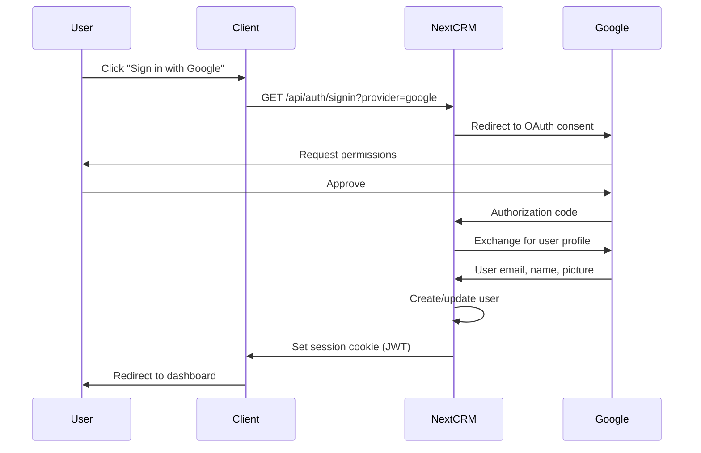
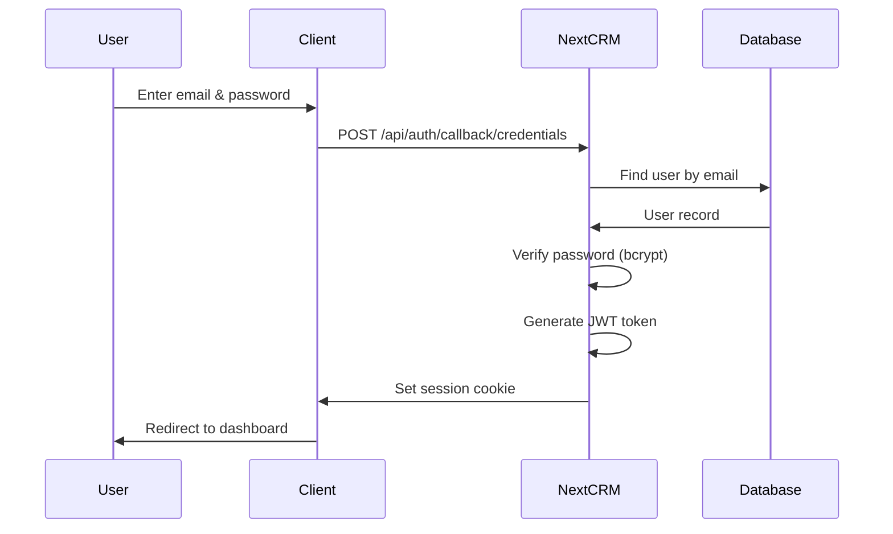

# NextCRM API Authentication Guide

## Table of Contents

- [Overview](#overview)
- [Authentication Methods](#authentication-methods)
- [JWT Token Structure](#jwt-token-structure)
- [Token Lifecycle](#token-lifecycle)
- [OAuth Setup](#oauth-setup)
- [API Key Generation](#api-key-generation)
- [CORS Configuration](#cors-configuration)
- [Rate Limits by Auth Type](#rate-limits-by-auth-type)
- [Security Best Practices](#security-best-practices)
- [Troubleshooting](#troubleshooting)

---

## Overview

NextCRM API uses **JWT (JSON Web Token) Bearer authentication** for all API requests. The authentication system is built on **NextAuth.js 4.24.10** with support for multiple authentication providers.

### Key Features

- **Multi-Provider Support**: OAuth (Google, GitHub) and traditional credentials (email/password)
- **JWT Strategy**: Stateless authentication with 24-hour token expiration
- **Multi-Tenancy**: Organization-based isolation with RBAC (Role-Based Access Control)
- **Session Refresh**: Automatic token refresh to maintain user sessions
- **Security Hardening**: Bcrypt password hashing, secure cookie storage, CORS protection

---

## Authentication Methods

NextCRM supports three authentication methods:

### 1. OAuth Authentication (Google)

**Recommended for:**
- Quick user onboarding
- SMB workshop owners
- Users without enterprise SSO requirements

**Flow:**


**Example:**

```javascript
// Client-side (Next.js)
import { signIn } from 'next-auth/react';

// Initiate Google OAuth
await signIn('google', { callbackUrl: '/dashboard' });
```

### 2. OAuth Authentication (GitHub)

**Recommended for:**
- Developer-friendly authentication
- Technical teams
- Open-source community users

**Flow:**
Similar to Google OAuth but uses GitHub as the identity provider.

**Example:**

```javascript
// Client-side (Next.js)
import { signIn } from 'next-auth/react';

// Initiate GitHub OAuth
await signIn('github', { callbackUrl: '/dashboard' });
```

### 3. Credentials Authentication (Email/Password)

**Recommended for:**
- Enterprise environments with SSO restrictions
- Users who prefer not to use OAuth
- Custom authentication workflows

**Security Features:**
- Bcrypt password hashing (10 rounds)
- Trimmed password input (removes accidental whitespace)
- Clear error messages (without revealing too much for security)

**Flow:**



**Example:**

```javascript
// Client-side (Next.js)
import { signIn } from 'next-auth/react';

const result = await signIn('credentials', {
  email: 'user@example.com',
  password: 'yourpassword',
  redirect: false
});

if (result?.error) {
  console.error('Login failed:', result.error);
} else {
  // Login successful, redirect to dashboard
  router.push('/dashboard');
}
```

**API Request Example:**

```bash
curl -X POST "https://api.nextcrm.io/api/auth/callback/credentials" \
  -H "Content-Type: application/json" \
  -d '{
    "email": "user@example.com",
    "password": "yourpassword"
  }'
```

---

## JWT Token Structure

NextCRM uses **JWT tokens** for stateless authentication. Tokens are signed with a cryptographically secure secret and contain user identification data.

### Token Payload

```json
{
  "user": {
    "id": "60d5ec49f1b2c8b1f8e4e1a2",
    "name": "John Doe",
    "email": "john@acme.com",
    "avatar": "https://example.com/avatar.jpg",
    "image": "https://example.com/avatar.jpg",
    "isAdmin": false,
    "userLanguage": "en",
    "userStatus": "ACTIVE",
    "lastLoginAt": "2025-01-15T10:00:00.000Z",
    "organizationId": "60d5ec49f1b2c8b1f8e4e1a0",
    "organization_role": "OWNER"
  },
  "iat": 1705320000,
  "exp": 1705406400,
  "jti": "abc123def456"
}
```

### Token Claims

| Claim | Type | Description |
|-------|------|-------------|
| `user.id` | string | User ID (MongoDB ObjectId) |
| `user.email` | string | User email address |
| `user.name` | string | Display name |
| `user.avatar` | string | Profile image URL |
| `user.isAdmin` | boolean | System admin flag (super admin) |
| `user.userLanguage` | string | Preferred language (en, de, cz, uk) |
| `user.userStatus` | string | User status (ACTIVE, INACTIVE, PENDING) |
| `user.organizationId` | string | Organization ID (multi-tenancy key) |
| `user.organization_role` | string | RBAC role (OWNER, ADMIN, MEMBER, VIEWER) |
| `iat` | number | Issued at (Unix timestamp) |
| `exp` | number | Expiration time (Unix timestamp) |
| `jti` | string | JWT ID (unique token identifier) |

### Critical Fields for Multi-Tenancy

**`organizationId`** - The primary tenant isolation key:
- ALL database queries MUST filter by `organizationId`
- Prevents cross-organization data leakage
- NULL value indicates user has no organization (onboarding incomplete)

**`organization_role`** - RBAC permissions:
- `OWNER`: Full access, billing, user management
- `ADMIN`: Full CRM access, user invitations, no billing access
- `MEMBER`: Create/edit/delete own resources, view organization resources
- `VIEWER`: Read-only access to organization resources

---

## Token Lifecycle

### 1. Token Creation

Tokens are created automatically during the authentication flow:

```javascript
// Server-side (NextAuth callback)
async session({ token, session }) {
  const user = await prismadb.users.findFirst({
    where: { email: token.email },
    include: { organization: true }
  });

  session.user = {
    id: user.id,
    email: user.email,
    organizationId: user.organizationId,
    organization_role: user.organization_role,
    // ... other user fields
  };

  return session;
}
```

### 2. Token Expiration

**Default Expiration:** 24 hours (86400 seconds)

Tokens expire after 24 hours to balance security and user experience:
- **Security**: Limits exposure if token is compromised
- **UX**: Users don't need to re-authenticate frequently

### 3. Token Refresh

To refresh an expired or expiring token:

**Endpoint:** `POST /api/auth/session`

**Example:**

```javascript
// Client-side (Next.js)
import { useSession } from 'next-auth/react';

const { data: session, update } = useSession();

// Manually refresh session
await update();

// New session with fresh token returned
console.log('Refreshed session:', session);
```

**API Request:**

```bash
curl -X POST "https://api.nextcrm.io/api/auth/session" \
  -H "Authorization: Bearer YOUR_OLD_JWT_TOKEN"
```

**Response:**

```json
{
  "user": {
    "id": "60d5ec49f1b2c8b1f8e4e1a2",
    "email": "john@acme.com",
    // ... updated user data
  },
  "expires": "2025-01-16T10:00:00.000Z"
}
```

### 4. Token Revocation

**Important:** NextCRM uses JWT strategy (stateless), which means:

- ❌ **Cannot force-logout users** until JWT expires
- ✅ **Workaround 1:** Short JWT expiry (24 hours default)
- ✅ **Workaround 2:** Deactivate user (blocks new logins, existing tokens valid until expiration)
- ✅ **Workaround 3:** Change user's `userStatus` to INACTIVE (enforced on every request)

**Deactivate User (Admin Only):**

```bash
curl -X PUT "https://api.nextcrm.io/api/user/deactivate/USER_ID" \
  -H "Authorization: Bearer ADMIN_JWT_TOKEN"
```

This changes `userStatus` to INACTIVE, which is checked on every API request.

---

## OAuth Setup

### Google OAuth Configuration

**Step 1: Create OAuth Client**

1. Go to [Google Cloud Console](https://console.cloud.google.com/apis/credentials)
2. Create new project or select existing
3. Navigate to **APIs & Services** → **Credentials**
4. Click **Create Credentials** → **OAuth client ID**
5. Select **Web application**

**Step 2: Configure Authorized Redirect URIs**

Add these redirect URIs (replace with your domain):

```
Production:
https://api.nextcrm.io/api/auth/callback/google

Demo:
https://demo.nextcrm.io/api/auth/callback/google

Local Development:
http://localhost:3000/api/auth/callback/google
```

**Step 3: Set Environment Variables**

```bash
# .env.local
GOOGLE_ID=123456789-abcdefghijklmnop.apps.googleusercontent.com
GOOGLE_SECRET=GOCSPX-your-secret-here
```

**Common Issues:**

- ❌ **Error: redirect_uri_mismatch**
  - Cause: Redirect URI not registered in Google Console
  - Fix: Add exact callback URL (http vs https matters!)

- ❌ **Error: invalid_client**
  - Cause: GOOGLE_ID or GOOGLE_SECRET incorrect
  - Fix: Copy credentials exactly from Google Console (no trailing spaces)

### GitHub OAuth Configuration

**Step 1: Register OAuth App**

1. Go to [GitHub Developer Settings](https://github.com/settings/developers)
2. Click **New OAuth App**
3. Fill in application details:
   - **Application name:** NextCRM
   - **Homepage URL:** `https://api.nextcrm.io`
   - **Authorization callback URL:** `https://api.nextcrm.io/api/auth/callback/github`

**Step 2: Get Client ID and Secret**

1. Click **Generate a new client secret**
2. Copy **Client ID** and **Client Secret**

**Step 3: Set Environment Variables**

```bash
# .env.local
GITHUB_ID=Iv1.abc123def456
GITHUB_SECRET=your-github-secret-here
```

**Common Issues:**

- ❌ **Error: redirect_uri_mismatch**
  - Cause: Callback URL doesn't match GitHub settings
  - Fix: Ensure exact match (trailing slash matters)

---

## API Key Generation

For **service-to-service authentication** or **programmatic API access**, use API keys.

### Creating an API Key

**Note:** NextCRM currently uses user JWT tokens for API access. To implement API keys:

1. **Add API Key Table:**

```prisma
model ApiKeys {
  id             String    @id @default(auto()) @map("_id") @db.ObjectId
  name           String
  key            String    @unique
  userId         String    @db.ObjectId
  organizationId String    @db.ObjectId
  scopes         String[]
  lastUsedAt     DateTime? @db.Date
  expiresAt      DateTime? @db.Date
  createdAt      DateTime  @default(now()) @db.Date
  revokedAt      DateTime? @db.Date

  user           Users         @relation(fields: [userId], references: [id])
  organization   Organizations @relation(fields: [organizationId], references: [id])
}
```

2. **Generate API Key:**

```javascript
import crypto from 'crypto';

const apiKey = `sk_${crypto.randomBytes(32).toString('hex')}`;
```

3. **Authenticate with API Key:**

```bash
curl -X GET "https://api.nextcrm.io/api/crm/account" \
  -H "Authorization: Bearer sk_abc123def456..."
```

### API Key Best Practices

- ✅ **Prefix:** Use `sk_` prefix for secret keys (easy to identify in logs)
- ✅ **Scopes:** Limit API key permissions (e.g., read-only, specific resources)
- ✅ **Expiration:** Set expiration dates for keys (90 days recommended)
- ✅ **Rotation:** Rotate keys quarterly
- ✅ **Revocation:** Provide instant revocation mechanism
- ✅ **Audit:** Log all API key usage (user, endpoint, timestamp)

---

## CORS Configuration

NextCRM API uses **CORS (Cross-Origin Resource Sharing)** to control which domains can access the API.

### Allowed Origins

**Production:**
```javascript
const allowedOrigins = [
  'https://app.nextcrm.io',
  'https://demo.nextcrm.io',
  'https://nextcrm.io'
];
```

**Development:**
```javascript
const allowedOrigins = [
  'http://localhost:3000',
  'http://localhost:3001'
];
```

### CORS Headers

```
Access-Control-Allow-Origin: https://app.nextcrm.io
Access-Control-Allow-Methods: GET, POST, PUT, DELETE, OPTIONS
Access-Control-Allow-Headers: Content-Type, Authorization
Access-Control-Max-Age: 86400
```

### Preflight Requests

For `PUT`, `DELETE`, and requests with custom headers, browsers send a preflight `OPTIONS` request:

```bash
curl -X OPTIONS "https://api.nextcrm.io/api/crm/account" \
  -H "Origin: https://app.nextcrm.io" \
  -H "Access-Control-Request-Method: PUT" \
  -H "Access-Control-Request-Headers: Content-Type, Authorization"
```

**Response:**

```
HTTP/1.1 200 OK
Access-Control-Allow-Origin: https://app.nextcrm.io
Access-Control-Allow-Methods: GET, POST, PUT, DELETE, OPTIONS
Access-Control-Allow-Headers: Content-Type, Authorization
```

### Troubleshooting CORS

**Error: "CORS policy: No 'Access-Control-Allow-Origin' header"**

- **Cause:** Request origin not in allowed list
- **Fix:** Add origin to CORS configuration or use same domain

**Error: "CORS policy: Request header field authorization is not allowed"**

- **Cause:** `Authorization` header not in `Access-Control-Allow-Headers`
- **Fix:** Add `Authorization` to allowed headers

---

## Rate Limits by Auth Type

NextCRM enforces different rate limits based on authentication type and subscription plan.

### Authenticated Requests (Organization-Based)

Rate limits are shared across all users in the same organization:

| Plan | Rate Limit | Reset Interval |
|------|-----------|----------------|
| FREE | 100 requests/hour | Every hour |
| PRO | 1,000 requests/hour | Every hour |
| ENTERPRISE | 10,000 requests/hour | Every hour |

**Identifier:** `org:60d5ec49f1b2c8b1f8e4e1a0`

**Advantage:** Fair usage across team members

**Example:**
- Acme Corp (PRO plan) has 5 users
- Combined, they can make 1,000 requests/hour
- If User A makes 800 requests, only 200 remain for other users

### Unauthenticated Requests (IP-Based)

Public endpoints (auth, health checks) use IP-based rate limiting:

| Endpoint Type | Rate Limit | Reset Interval |
|--------------|-----------|----------------|
| Public endpoints | 100 requests/hour | Every hour |
| Auth endpoints | 10 requests/minute | Every minute |

**Identifier:** `ip:203.0.113.1`

**Disadvantage:** Vulnerable to IP rotation attacks (VPN, TOR)

**Use Cases:**
- `/api/health` (load balancer health checks)
- `/api/auth/signin` (login attempts)
- `/api/auth/callback/*` (OAuth callbacks)

### Rate Limit Headers

All responses include rate limit information:

```
X-RateLimit-Limit: 1000
X-RateLimit-Remaining: 875
X-RateLimit-Reset: 1705939200
```

### Rate Limit Exceeded (429)

When rate limit is exceeded:

```json
{
  "error": "Too Many Requests",
  "message": "Rate limit exceeded. Please try again in 3600 seconds.",
  "code": "RATE_LIMIT_EXCEEDED",
  "details": {
    "limit": 1000,
    "remaining": 0,
    "resetTime": 1705939200,
    "retryAfter": 3600
  }
}
```

**Headers:**
```
HTTP/1.1 429 Too Many Requests
Retry-After: 3600
X-RateLimit-Limit: 1000
X-RateLimit-Remaining: 0
X-RateLimit-Reset: 1705939200
```

**Client Strategy:**

```javascript
async function makeApiRequest(url, options) {
  const response = await fetch(url, options);

  if (response.status === 429) {
    const retryAfter = response.headers.get('Retry-After');
    console.log(`Rate limit exceeded. Retry after ${retryAfter} seconds.`);

    // Wait and retry
    await new Promise(resolve => setTimeout(resolve, retryAfter * 1000));
    return makeApiRequest(url, options); // Retry
  }

  return response;
}
```

---

## Security Best Practices

### 1. Token Storage

**✅ Recommended: HTTP-only Cookie (Server-Side)**

```javascript
// Server sets cookie
res.setHeader('Set-Cookie', [
  `next-auth.session-token=${token}; HttpOnly; Secure; SameSite=Lax; Path=/; Max-Age=86400`
]);
```

**Advantages:**
- Not accessible via JavaScript (XSS protection)
- Automatically sent with requests
- Secure flag (HTTPS only)
- SameSite protection (CSRF mitigation)

**❌ Avoid: localStorage**

```javascript
// INSECURE - vulnerable to XSS
localStorage.setItem('token', jwt);
```

**Disadvantages:**
- Accessible via JavaScript (XSS risk)
- No automatic expiration
- No CSRF protection

### 2. Token Transmission

**✅ Always use HTTPS in production**

```bash
# SECURE
curl -X GET "https://api.nextcrm.io/api/crm/account" \
  -H "Authorization: Bearer JWT_TOKEN"

# INSECURE - token visible in network traffic
curl -X GET "http://api.nextcrm.io/api/crm/account" \
  -H "Authorization: Bearer JWT_TOKEN"
```

### 3. Token Validation

**Server-Side Validation Checklist:**

```javascript
// 1. Verify token signature
const decoded = jwt.verify(token, process.env.JWT_SECRET);

// 2. Check expiration
if (decoded.exp < Date.now() / 1000) {
  throw new Error('Token expired');
}

// 3. Verify user still exists
const user = await prismadb.users.findUnique({
  where: { id: decoded.user.id }
});

// 4. Check user status
if (user.userStatus !== 'ACTIVE') {
  throw new Error('User account inactive');
}

// 5. Verify organization access
if (user.organizationId !== decoded.user.organizationId) {
  throw new Error('Organization mismatch');
}
```

### 4. Password Security

**Requirements:**
- Minimum 8 characters (enforced at registration)
- Bcrypt hashing with 10 rounds
- No password in JWT token or session
- Password reset via email verification

**Password Hashing:**

```javascript
import bcrypt from 'bcrypt';

// Hash password (registration)
const hashedPassword = await bcrypt.hash(password, 10);

// Verify password (login)
const isValid = await bcrypt.compare(password, user.password);
```

### 5. Session Security

**Session Callback Security:**

```javascript
async session({ token, session }) {
  // ALWAYS fetch user data from database (don't trust JWT claims)
  const user = await prismadb.users.findFirst({
    where: { email: token.email }
  });

  // Verify user is active
  if (user.userStatus !== 'ACTIVE') {
    throw new Error('User account inactive');
  }

  // Populate session with fresh data
  session.user = {
    id: user.id,
    organizationId: user.organizationId,
    organization_role: user.organization_role
  };

  return session;
}
```

### 6. CSRF Protection

NextAuth.js provides built-in CSRF protection:

```javascript
// CSRF token automatically included in forms
<form method="post" action="/api/auth/signin/email">
  <input type="hidden" name="csrfToken" value={csrfToken} />
  <input type="email" name="email" />
  <button type="submit">Sign in</button>
</form>
```

---

## Troubleshooting

### Common Authentication Errors

#### 1. "Unauthenticated" (401)

**Cause:** Missing or invalid JWT token

**Solutions:**
- Verify token is included in `Authorization` header
- Check token hasn't expired (24 hours)
- Ensure user is logged in (`useSession()` returns session)

**Debug:**

```javascript
// Client-side
import { useSession } from 'next-auth/react';

const { data: session, status } = useSession();

console.log('Session status:', status); // loading, authenticated, unauthenticated
console.log('Session data:', session);
```

#### 2. "User organization not found" (401)

**Cause:** User hasn't joined or created an organization

**Solution:**
- Redirect user to organization creation/join flow
- Check `session.user.organizationId` is not null

**Fix:**

```javascript
const { data: session } = useSession();

if (!session?.user?.organizationId) {
  router.push('/onboarding'); // Create/join organization
}
```

#### 3. "Forbidden" (403)

**Cause:** Insufficient permissions for the requested operation

**Solutions:**
- Verify user role has required permissions
- Check endpoint-specific role requirements (e.g., OWNER only)

**Debug:**

```javascript
console.log('User role:', session?.user?.organization_role);
// OWNER, ADMIN, MEMBER, or VIEWER
```

#### 4. OAuth "redirect_uri_mismatch"

**Cause:** Callback URL doesn't match OAuth provider settings

**Solution:**
- Google: Check [Google Cloud Console](https://console.cloud.google.com/apis/credentials)
- GitHub: Check [GitHub Developer Settings](https://github.com/settings/developers)
- Ensure exact match: `https://api.nextcrm.io/api/auth/callback/google`

#### 5. "Invalid email or password"

**Cause:** Incorrect credentials or user not registered

**Solutions:**
- Verify email spelling
- Check password (trim whitespace)
- Confirm user has registered (check database)

**User Not Found:**

```bash
# Check if user exists
curl -X GET "https://api.nextcrm.io/api/user/by-email?email=user@example.com" \
  -H "Authorization: Bearer ADMIN_TOKEN"
```

### Debugging Tools

#### 1. NextAuth Debug Mode

Enable debug logging in development:

```bash
# Terminal
DEBUG=nextauth:* npm run dev
```

#### 2. Inspect JWT Token

Decode JWT token (do NOT use untrusted decoders in production):

```javascript
// Client-side debugging only
import jwt_decode from 'jwt-decode';

const token = session?.accessToken;
const decoded = jwt_decode(token);

console.log('Token payload:', decoded);
console.log('Expires at:', new Date(decoded.exp * 1000));
```

#### 3. Check Session in API Route

```javascript
// Server-side API route
import { getServerSession } from 'next-auth';
import { authOptions } from '@/lib/auth';

export async function GET(req) {
  const session = await getServerSession(authOptions);

  console.log('Session:', JSON.stringify(session, null, 2));

  if (!session) {
    return new Response('Unauthenticated', { status: 401 });
  }

  // ... rest of handler
}
```

---

## Summary

**Key Takeaways:**

1. ✅ **Always use HTTPS** in production
2. ✅ **Store tokens in HTTP-only cookies** (not localStorage)
3. ✅ **Refresh tokens before expiration** (24-hour lifespan)
4. ✅ **Validate organizationId** on every request (multi-tenancy)
5. ✅ **Check userStatus** (ACTIVE, INACTIVE, PENDING)
6. ✅ **Enforce RBAC** (OWNER > ADMIN > MEMBER > VIEWER)
7. ✅ **Monitor rate limits** (plan-based quotas)
8. ✅ **Audit all authentication events** (login, logout, failures)

**Next Steps:**

- [REST API Reference](./REST-API.md) - Comprehensive endpoint documentation
- [Error Codes](./ERROR_CODES.md) - Detailed error handling guide
- [OpenAPI Spec](./openapi.json) - Machine-readable API definition

---

**Generated with Claude Code**
**Version:** 3.0.0-alpha
**Last Updated:** 2025-01-15
