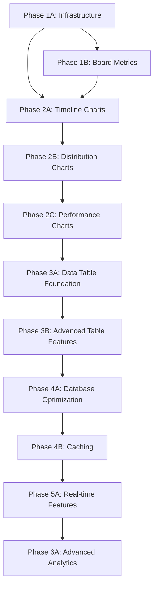

# Dashboard Development Roadmap for TaskHQ

## Overview

This roadmap provides a systematic approach to implementing real data-driven dashboard functionality in TaskHQ, replacing mock data with live analytics and comprehensive business metrics. The implementation is divided into manageable phases that can be completed independently while building toward a complete analytics platform.

## Current State

### Existing Components

- **SectionCards**: Hardcoded metrics (Projects: 1,234, Tasks: 1,234)
- **ChartAreaInteractive**: Mock visitor data with desktop/mobile metrics
- **DataTable**: Uses mock JSON data for testing purposes
- **Layout**: Responsive design with sidebar integration

### Available Database Schema

- **Users**: Multi-tenant with company ID (cid)
- **Tasks**: Full CRUD with status, priority, assignments, due dates
- **Boards**: Project boards with sections
- **BoardSections**: Kanban-style columns
- **TaskHistory**: Audit trail for changes
- **AI Conversations**: Chat history and summaries
- **Documents**: File uploads with AI processing
- **Security Audit Logs**: User activity tracking

## Implementation Strategy

### Phase Breakdown

The implementation is divided into 12 manageable phases, each designed to be completed in 3-7 days:

#### **Foundation Phase (Weeks 1-2)**

- **Phase 1A**: Infrastructure & Task Metrics
- **Phase 1B**: Board & User Metrics

#### **Visualization Phase (Weeks 2-4)**

- **Phase 2A**: Task Timeline Charts
- **Phase 2B**: Distribution & Status Charts
- **Phase 2C**: Team Performance Charts

#### **Data Table Phase (Weeks 4-6)**

- **Phase 3A**: Real Data Table Foundation
- **Phase 3B**: Advanced Table Features

#### **Performance Phase (Weeks 6-7)**

- **Phase 4A**: Database Optimization
- **Phase 4B**: Caching Implementation

#### **Advanced Features Phase (Weeks 7-9)**

- **Phase 5A**: Real-time Features
- **Phase 6A**: Advanced Analytics

## Phase Dependencies



## Technical Standards

### TaskHQ Implementation Rules

Each phase must follow the established TaskHQ patterns:

1. **Database Connection**: Use centralized `import db from '@/lib/db'`
2. **Session Validation**: Every server action must use `auth()` from Next-Auth v5
3. **Company Data Isolation**: All queries must filter by `cid` (company ID)
4. **Input Validation**: Use Zod schemas for all user inputs
5. **Error Handling**: Follow established try/catch patterns
6. **File Organization**: Actions in `/actions/dashboard/`, components in `/components/dashboard/`
7. **UI Standards**: Use shadcn/ui components (New York style, neutral base)
8. **Build Verification**: Each phase must pass `pnpm build` and `pnpm lint`

### Phase Completion Criteria

Each phase is considered complete when:

- [ ] All TypeScript compilation errors resolved
- [ ] All ESLint warnings/errors fixed
- [ ] Server actions validate session and filter by company ID
- [ ] Input validation implemented with Zod schemas
- [ ] Error handling follows established patterns
- [ ] UI components are responsive and accessible
- [ ] Tests written and passing
- [ ] Phase resume document created
- [ ] Build and lint verification completed

## File Structure

```
roadmap/dashboard-implementation/
├── dashboard-development-roadmap.md (this file)
├── phase1a-infrastructure-task-metrics.md
├── phase1b-board-user-metrics.md
├── phase2a-task-timeline-charts.md
├── phase2b-distribution-status-charts.md
├── phase2c-team-performance-charts.md
├── phase3a-real-data-table-foundation.md
├── phase3b-advanced-table-features.md
├── phase4a-database-optimization.md
├── phase4b-caching-implementation.md
├── phase5a-realtime-features.md
├── phase6a-advanced-analytics.md
└── dashboard-dev-resume.md (created after completion)
```

## Expected Outcomes

### Phase 1 Completion

- Real task and board metrics replacing hardcoded values
- Functional dashboard infrastructure with proper security
- Company-scoped data filtering implemented

### Phase 2 Completion

- Interactive charts showing actual task and team data
- Timeline visualizations replacing mock visitor data
- Priority and status distribution charts

### Phase 3 Completion

- Dynamic data table with real task data
- Advanced filtering, sorting, and search functionality
- Bulk operations and task management features

### Phase 4 Completion

- Optimized database queries with proper indexing
- Caching layer for improved performance
- Monitoring and metrics collection

### Phase 5-6 Completion

- Real-time updates and notifications
- Advanced analytics and predictive features
- Custom dashboard configurations

## Timeline Estimates

| Phase | Duration | Parallel Work Possible |
| ----- | -------- | ---------------------- |
| 1A    | 3-5 days | No (foundation)        |
| 1B    | 3-4 days | Partial (after 1A)     |
| 2A    | 4-5 days | Partial (after 1A+1B)  |
| 2B    | 3-4 days | Yes (with 2A)          |
| 2C    | 3-4 days | Yes (with 2A+2B)       |
| 3A    | 4-6 days | No (needs 1A+1B)       |
| 3B    | 4-5 days | No (needs 3A)          |
| 4A    | 3-4 days | Partial (with 3B)      |
| 4B    | 3-4 days | Yes (with 4A)          |
| 5A    | 5-7 days | No (needs 4A+4B)       |
| 6A    | 5-7 days | Partial (with 5A)      |

**Total Estimated Time**: 8-10 weeks with optimal resource allocation

## Risk Mitigation

### Technical Risks

- **Database Performance**: Address with Phase 4A optimization
- **Real-time Updates**: Implement gradually in Phase 5A
- **Complex Queries**: Use caching and indexing strategies

### Development Risks

- **Phase Dependencies**: Clear documentation and handoff procedures
- **Code Quality**: Mandatory build/lint verification for each phase
- **Integration Issues**: Incremental integration with testing at each step

## Success Metrics

### Technical Metrics

- Dashboard load time < 2 seconds
- Database query performance < 500ms average
- Build and lint pass rate: 100%
- Test coverage > 80%

### Business Metrics

- User engagement with dashboard features
- Task completion insights accuracy
- Team productivity visibility improvements
- Time-to-insight for managers

## Next Steps

1. Review and approve this roadmap
2. Begin with Phase 1A implementation
3. Follow phase documentation for step-by-step guidance
4. Complete phase verification checklist before proceeding
5. Create resume documentation after each phase

This roadmap ensures systematic, high-quality implementation of dashboard functionality while maintaining TaskHQ's established patterns and standards.
