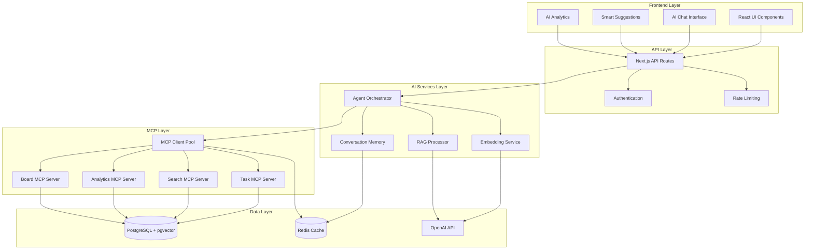
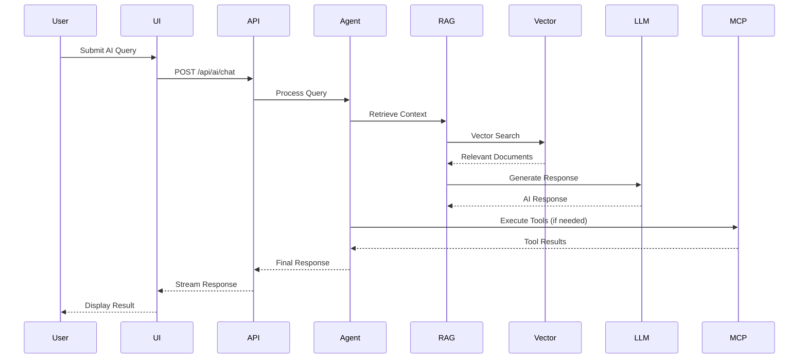
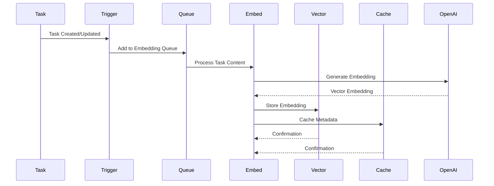

# Phase 5: Developer Architecture & Integration

## Overview

This phase provides comprehensive technical documentation for developers working with the TaskHQ RAG system. It covers system architecture, API references, integration patterns, and development workflows for extending and maintaining the AI-powered features.

## Target Audience

- **Primary**: Software developers and engineers
- **Secondary**: Technical architects and system integrators
- **Technical Level**: Advanced programming and system design knowledge

## Prerequisites

- Phase 3-4 administrator documentation completed for operational context
- Development environment set up with TaskHQ codebase access
- Understanding of Next.js, TypeScript, PostgreSQL, and AI concepts
- Familiarity with RAG architecture and MCP protocol

## Implementation Batches

### Batch 5.1: System Architecture Overview

**Estimated Time**: 4-5 hours
**Deliverables**: Comprehensive architectural documentation with diagrams

#### Tasks:

- [ ] Document overall system architecture and component relationships
- [ ] Detail RAG pipeline architecture and data flow
- [ ] Explain MCP server architecture and tool integration
- [ ] Cover AI agent orchestration and decision-making systems
- [ ] Include database schema and vector storage architecture

#### System Architecture Documentation:

````markdown
## TaskHQ RAG System Architecture

### High-Level Architecture


````

### Core Components

#### 1. Agent Orchestrator

- **Purpose**: Central AI agent coordination and routing
- **Location**: `/lib/ai/agent-orchestrator.ts`
- **Responsibilities**:
  - Route queries to appropriate specialized agents
  - Manage conversation context and memory
  - Coordinate multi-step workflows
  - Handle tool calling and MCP server communication

```typescript
// Agent Orchestrator Interface
export interface AgentOrchestrator {
  // Main query processing
  processQuery(query: string, context: RAGContext): Promise<AgentResponse>;

  // Specialized agent routing
  routeToAgent(query: string, context: RAGContext): Promise<string>;

  // Multi-step workflow coordination
  executeWorkflow(workflow: AIWorkflow): Promise<WorkflowResult>;

  // Tool coordination
  executeTool(toolName: string, params: unknown): Promise<ToolResult>;
}
```

#### 2. RAG Processor

- **Purpose**: Retrieval-Augmented Generation pipeline
- **Location**: `/lib/ai/rag-processor.ts`
- **Responsibilities**:
  - Query preprocessing and enhancement
  - Vector similarity search
  - Context assembly and ranking
  - Response generation with citations

```typescript
// RAG Processor Interface
export interface RAGProcessor {
  // Main RAG pipeline
  processRAGQuery(query: string, context: RAGContext): Promise<RAGResponse>;

  // Retrieval operations
  retrieveRelevantDocs(
    query: string,
    filters?: SearchFilters,
  ): Promise<RetrievedDocument[]>;

  // Context assembly
  assembleContext(
    docs: RetrievedDocument[],
    query: string,
  ): Promise<AssembledContext>;

  // Response generation
  generateResponse(
    context: AssembledContext,
    query: string,
  ): Promise<GeneratedResponse>;
}
```

#### 3. MCP Server Architecture

- **Purpose**: Standardized tool interface for AI agents
- **Location**: `/app/api/mcp/[server]/[transport]/route.ts`
- **Responsibilities**:
  - Expose TaskHQ operations as standardized tools
  - Handle authentication and authorization
  - Provide type-safe parameter validation
  - Manage concurrent tool execution

```typescript
// MCP Server Tool Definition
export interface MCPTool {
  name: string;
  description: string;
  parameters: JSONSchema;
  execute: (params: unknown, context: AuthContext) => Promise<ToolResult>;
  requiredPermissions: UserRole[];
  rateLimits?: RateLimitConfig;
}

// Example Tool Implementation
const createTaskTool: MCPTool = {
  name: "create_task",
  description: "Create a new task in the specified board",
  parameters: {
    type: "object",
    properties: {
      title: { type: "string" },
      description: { type: "string" },
      boardId: { type: "string" },
      priority: { type: "string", enum: ["LOW", "MEDIUM", "HIGH", "CRITICAL"] },
    },
    required: ["title", "boardId"],
  },
  requiredPermissions: ["CONTRIBUTOR"],
  execute: async (params, context) => {
    // Implementation
  },
};
```

### Data Flow Architecture

#### RAG Query Processing Flow



#### Embedding Generation Flow



### Database Schema Architecture

#### Core Tables with AI Extensions

```sql
-- Existing TaskHQ tables with AI enhancements
CREATE TABLE tasks (
  id TEXT PRIMARY KEY,
  title TEXT NOT NULL,
  description TEXT,
  company_id TEXT NOT NULL,
  board_id TEXT NOT NULL,
  -- ... existing fields
  ai_priority_score FLOAT,        -- AI-calculated priority
  ai_effort_estimate INTEGER,     -- AI effort estimation
  ai_last_analyzed TIMESTAMP      -- Last AI analysis
);

-- AI-specific tables
CREATE TABLE task_embeddings (
  id TEXT PRIMARY KEY,
  task_id TEXT UNIQUE NOT NULL,
  embedding VECTOR(1536),         -- OpenAI ada-002 dimensions
  content TEXT NOT NULL,          -- Source content for embedding
  metadata JSONB,                 -- Additional context
  created_at TIMESTAMP DEFAULT NOW(),
  updated_at TIMESTAMP DEFAULT NOW(),

  FOREIGN KEY (task_id) REFERENCES tasks(id) ON DELETE CASCADE
);

CREATE TABLE ai_conversations (
  id TEXT PRIMARY KEY,
  user_id TEXT NOT NULL,
  company_id TEXT NOT NULL,
  title TEXT,
  context JSONB,                  -- Conversation context
  created_at TIMESTAMP DEFAULT NOW(),
  updated_at TIMESTAMP DEFAULT NOW(),

  FOREIGN KEY (user_id) REFERENCES users(id),
  FOREIGN KEY (company_id) REFERENCES companies(id)
);

CREATE TABLE ai_messages (
  id TEXT PRIMARY KEY,
  conversation_id TEXT NOT NULL,
  role TEXT NOT NULL,             -- 'user' | 'assistant' | 'system'
  content TEXT NOT NULL,
  metadata JSONB,                 -- Tool calls, citations, etc.
  created_at TIMESTAMP DEFAULT NOW(),

  FOREIGN KEY (conversation_id) REFERENCES ai_conversations(id) ON DELETE CASCADE
);

-- Vector indexes for performance
CREATE INDEX CONCURRENTLY idx_task_embeddings_vector
ON task_embeddings USING ivfflat (embedding vector_cosine_ops)
WITH (lists = 100);

CREATE INDEX CONCURRENTLY idx_document_embeddings_vector
ON document_embeddings USING ivfflat (embedding vector_cosine_ops)
WITH (lists = 100);
```

#### Indexing Strategy

```sql
-- Company isolation indexes
CREATE INDEX CONCURRENTLY idx_tasks_company_created
ON tasks(company_id, created_at DESC);

CREATE INDEX CONCURRENTLY idx_ai_conversations_company_user
ON ai_conversations(company_id, user_id, created_at DESC);

-- AI-specific performance indexes
CREATE INDEX CONCURRENTLY idx_task_embeddings_updated
ON task_embeddings(updated_at DESC);

CREATE INDEX CONCURRENTLY idx_ai_messages_conversation_created
ON ai_messages(conversation_id, created_at DESC);

-- Full-text search indexes
CREATE INDEX CONCURRENTLY idx_tasks_content_search
ON tasks USING gin(to_tsvector('english', title || ' ' || COALESCE(description, '')));
```

````

### Batch 5.2: API Reference and Integration Patterns

**Estimated Time**: 4-5 hours
**Deliverables**: Complete API documentation with examples and integration guides

#### Tasks:

- [ ] Document all AI-related API endpoints with examples
- [ ] Detail authentication and authorization patterns
- [ ] Cover rate limiting and error handling
- [ ] Explain streaming responses and real-time features
- [ ] Include SDK usage patterns and best practices

#### API Reference Documentation:

```markdown
## TaskHQ AI API Reference

### Authentication

All AI API endpoints require valid authentication using NextAuth.js session cookies or API keys.

```typescript
// Client-side authentication (session cookies)
import { useSession } from 'next-auth/react';

function useAIAPI() {
  const { data: session } = useSession();

  if (!session) {
    throw new Error('Authentication required for AI features');
  }

  return {
    chat: (messages: Message[]) =>
      fetch('/api/ai/chat', {
        method: 'POST',
        headers: { 'Content-Type': 'application/json' },
        body: JSON.stringify({ messages }),
      }),
  };
}

// Server-side authentication (API keys)
export async function authenticateAPIKey(apiKey: string): Promise<User | null> {
  const key = await db.apiKey.findUnique({
    where: { key: apiKey, active: true },
    include: { user: true },
  });

  return key?.user || null;
}
````

### Core AI Endpoints

#### 1. Chat Interface - `/api/ai/chat`

**Purpose**: Main conversational AI interface with streaming responses

```typescript
// Request Interface
interface ChatRequest {
  messages: Array<{
    role: 'user' | 'assistant' | 'system';
    content: string;
  }>;
  boardId?: string;          // Current board context
  taskId?: string;           // Current task context
  useRAG?: boolean;          // Enable RAG processing (default: true)
  stream?: boolean;          // Enable streaming (default: true)
  temperature?: number;      // AI temperature (0-1)
  maxTokens?: number;        // Response length limit
}

// Response Interface (Streaming)
interface ChatResponse {
  id: string;
  choices: Array<{
    delta: {
      role?: string;
      content?: string;
    };
    finish_reason?: 'stop' | 'length' | 'tool_calls';
  }>;
  usage?: {
    prompt_tokens: number;
    completion_tokens: number;
    total_tokens: number;
  };
}

// Usage Example
import { useChat } from 'ai/react';

export function ChatInterface({ boardId }: { boardId?: string }) {
  const { messages, input, handleInputChange, handleSubmit, isLoading } = useChat({
    api: '/api/ai/chat',
    body: { boardId },
    onError: (error) => console.error('Chat error:', error),
  });

  return (
    <div>
      {messages.map(message => (
        <div key={message.id}>
          <strong>{message.role}:</strong> {message.content}
        </div>
      ))}

      <form onSubmit={handleSubmit}>
        <input
          value={input}
          onChange={handleInputChange}
          placeholder="Ask about your tasks..."
        />
        <button type="submit" disabled={isLoading}>
          Send
        </button>
      </form>
    </div>
  );
}
```

#### 2. Smart Suggestions - `/api/ai/suggest`

**Purpose**: Generate contextual suggestions for tasks and workflows

```typescript
// Request Interface
interface SuggestRequest {
  context: {
    boardId?: string;
    taskId?: string;
    userId?: string;
  };
  type: 'task_creation' | 'priority_optimization' | 'assignment' | 'workflow';
  limit?: number;            // Number of suggestions (default: 5)
}

// Response Interface
interface SuggestResponse {
  suggestions: Array<{
    type: string;
    title: string;
    description: string;
    reasoning: string;
    confidence: number;       // 0-1 confidence score
    action?: {
      type: string;
      parameters: Record<string, unknown>;
    };
  }>;
  metadata: {
    processingTime: number;
    contextUsed: string[];
    ragResults?: number;
  };
}

// Usage Example
import { useCompletion } from 'ai/react';

export function SmartSuggestions({ boardId }: { boardId: string }) {
  const { completion, complete, isLoading } = useCompletion({
    api: '/api/ai/suggest',
  });

  const generateSuggestions = () => {
    complete(JSON.stringify({
      context: { boardId },
      type: 'task_creation',
      limit: 3,
    }));
  };

  return (
    <div>
      <button onClick={generateSuggestions} disabled={isLoading}>
        Get AI Suggestions
      </button>

      {completion && (
        <div>
          <h3>AI Suggestions</h3>
          <pre>{completion}</pre>
        </div>
      )}
    </div>
  );
}
```

#### 3. Document Processing - `/api/ai/documents`

**Purpose**: Upload and process documents with AI analysis

```typescript
// Request Interface (Multipart Form)
interface DocumentRequest {
  file: File;                // Document file
  taskId?: string;           // Associate with task
  boardId?: string;          // Associate with board
  extractInsights?: boolean; // Enable AI insights (default: true)
  generateSummary?: boolean; // Generate summary (default: true)
}

// Response Interface
interface DocumentResponse {
  documentId: string;
  filename: string;
  extractedText: string;
  summary?: string;
  insights?: Array<{
    type: 'action_item' | 'risk' | 'opportunity' | 'decision';
    content: string;
    confidence: number;
  }>;
  embeddingId?: string;      // Vector embedding ID
  processingTime: number;
}

// Usage Example
export function DocumentUpload({ taskId }: { taskId?: string }) {
  const [file, setFile] = useState<File | null>(null);
  const [result, setResult] = useState<DocumentResponse | null>(null);
  const [uploading, setUploading] = useState(false);

  const handleUpload = async () => {
    if (!file) return;

    setUploading(true);
    const formData = new FormData();
    formData.append('file', file);
    if (taskId) formData.append('taskId', taskId);

    try {
      const response = await fetch('/api/ai/documents', {
        method: 'POST',
        body: formData,
      });

      const result = await response.json();
      setResult(result);
    } catch (error) {
      console.error('Upload error:', error);
    } finally {
      setUploading(false);
    }
  };

  return (
    <div>
      <input
        type="file"
        onChange={(e) => setFile(e.target.files?.[0] || null)}
        accept=".pdf,.docx,.txt,.md"
      />

      <button onClick={handleUpload} disabled={!file || uploading}>
        {uploading ? 'Processing...' : 'Upload & Analyze'}
      </button>

      {result && (
        <div>
          <h3>Analysis Results</h3>
          <p><strong>Summary:</strong> {result.summary}</p>

          {result.insights && (
            <div>
              <h4>Key Insights</h4>
              {result.insights.map((insight, i) => (
                <div key={i}>
                  <strong>{insight.type}:</strong> {insight.content}
                  <small> (confidence: {Math.round(insight.confidence * 100)}%)</small>
                </div>
              ))}
            </div>
          )}
        </div>
      )}
    </div>
  );
}
```

### Integration Patterns

#### Server Actions Integration

```typescript
// AI-enhanced server action
"use server";

import { auth } from "@/auth";
import { agentOrchestrator } from "@/lib/ai/agent-orchestrator";
import { revalidatePath } from "next/cache";

export async function createTaskWithAI(formData: FormData) {
  const session = await auth();
  if (!session?.user) {
    return { error: "Authentication required" };
  }

  const description = formData.get("description") as string;
  const boardId = formData.get("boardId") as string;

  try {
    // Use AI to enhance task creation
    const aiEnhancement = await agentOrchestrator.processQuery(
      `Enhance this task description and suggest priority: "${description}"`,
      {
        boardId,
        userId: session.user.id,
        companyId: session.user.companyId,
      },
    );

    // Create task with AI enhancements
    const task = await db.task.create({
      data: {
        title: aiEnhancement.suggestedTitle || description,
        description: aiEnhancement.enhancedDescription || description,
        priority: aiEnhancement.suggestedPriority || "MEDIUM",
        boardId,
        companyId: session.user.companyId,
        createdBy: session.user.id,
      },
    });

    // Trigger embedding generation
    await triggerEmbeddingUpdate(task.id);

    revalidatePath(`/${session.user.companyId}/tasks`);
    return { success: true, task, aiInsights: aiEnhancement.insights };
  } catch (error) {
    console.error("AI task creation error:", error);
    return { error: "Failed to create task with AI assistance" };
  }
}
```

#### Real-time Updates Integration

```typescript
// Real-time AI suggestions with WebSocket/SSE
import { useEffect, useState } from "react";

export function useRealtimeAISuggestions(boardId: string) {
  const [suggestions, setSuggestions] = useState<Suggestion[]>([]);
  const [connection, setConnection] = useState<EventSource | null>(null);

  useEffect(() => {
    const eventSource = new EventSource(
      `/api/ai/suggest/stream?boardId=${boardId}`,
    );

    eventSource.onmessage = (event) => {
      const suggestion = JSON.parse(event.data);
      setSuggestions((prev) => [...prev, suggestion]);
    };

    eventSource.onerror = (error) => {
      console.error("SSE error:", error);
      eventSource.close();
    };

    setConnection(eventSource);

    return () => {
      eventSource.close();
    };
  }, [boardId]);

  const dismissSuggestion = (suggestionId: string) => {
    setSuggestions((prev) => prev.filter((s) => s.id !== suggestionId));
  };

  return { suggestions, dismissSuggestion };
}
```

````

### Batch 5.3: MCP Development and Extension Patterns

**Estimated Time**: 3-4 hours
**Deliverables**: MCP server development guide and extension patterns

#### Tasks:

- [ ] Document MCP server development patterns and best practices
- [ ] Explain tool creation and registration procedures
- [ ] Cover authentication and authorization in MCP context
- [ ] Detail testing and debugging MCP servers
- [ ] Include examples of custom MCP server creation

#### MCP Development Guide:

```markdown
## MCP Server Development Guide

### Creating Custom MCP Servers

#### Basic MCP Server Structure
```typescript
// /app/api/mcp/custom/[transport]/route.ts
import { createMcpHandler } from "@vercel/mcp-adapter";
import { z } from "zod";
import { auth } from "@/auth";
import db from "@/lib/db";

const handler = createMcpHandler(
  async (server) => {
    // Tool registration
    server.tool(
      "custom_tool_name",
      "Description of what this tool does",
      {
        // Zod schema for parameter validation
        parameter1: z.string().describe("Description of parameter1"),
        parameter2: z.number().optional().describe("Optional parameter"),
        parameter3: z.enum(["option1", "option2"]).describe("Enum parameter"),
      },
      async (params) => {
        // Authentication check
        const session = await auth();
        if (!session?.user) {
          throw new Error("Authentication required");
        }

        // Authorization check
        if (!hasPermission(session.user, "REQUIRED_PERMISSION")) {
          throw new Error("Insufficient permissions");
        }

        // Tool implementation
        try {
          const result = await implementToolLogic(params, session.user);

          return {
            content: [
              {
                type: "text",
                text: JSON.stringify(result, null, 2),
              },
            ],
          };
        } catch (error) {
          console.error(`Custom tool error:`, error);
          throw new Error(`Tool execution failed: ${error.message}`);
        }
      }
    );

    // Add more tools as needed
    server.tool("another_tool", /* ... */);
  },
  {
    // Server capabilities
    capabilities: {
      tools: {
        custom_tool_name: { description: "Custom tool for specific operations" },
        another_tool: { description: "Another custom tool" },
      },
    },
  },
  {
    // Server configuration
    basePath: "",
    verboseLogs: process.env.NODE_ENV === "development",
    maxDuration: 800,
  }
);

export { handler as GET, handler as POST, handler as DELETE };
````

#### Advanced Tool Patterns

##### 1. Batch Operations Tool

```typescript
server.tool(
  "batch_update_tasks",
  "Update multiple tasks based on criteria",
  {
    criteria: z.object({
      boardId: z.string(),
      status: z.array(z.enum(["NEW", "IN_PROGRESS", "COMPLETED"])).optional(),
      assigneeIds: z.array(z.string()).optional(),
      tags: z.array(z.string()).optional(),
    }),
    updates: z.object({
      priority: z.enum(["LOW", "MEDIUM", "HIGH", "CRITICAL"]).optional(),
      status: z
        .enum(["NEW", "IN_PROGRESS", "COMPLETED", "CANCELLED"])
        .optional(),
      assigneeIds: z.array(z.string()).optional(),
    }),
    dryRun: z.boolean().default(false),
  },
  async (params) => {
    const session = await auth();
    if (!session?.user) throw new Error("Authentication required");

    // Build query based on criteria
    const whereClause = {
      boardId: params.criteria.boardId,
      companyId: session.user.companyId,
      ...(params.criteria.status && { status: { in: params.criteria.status } }),
      ...(params.criteria.assigneeIds && {
        assigneeIds: { hasSome: params.criteria.assigneeIds },
      }),
    };

    if (params.dryRun) {
      // Return what would be updated without making changes
      const tasks = await db.task.findMany({ where: whereClause });
      return {
        content: [
          {
            type: "text",
            text: `Would update ${tasks.length} tasks`,
          },
        ],
      };
    }

    // Perform batch update
    const result = await db.task.updateMany({
      where: whereClause,
      data: params.updates,
    });

    // Trigger embedding updates for modified tasks
    if (result.count > 0) {
      const updatedTasks = await db.task.findMany({ where: whereClause });
      await Promise.all(
        updatedTasks.map((task) => triggerEmbeddingUpdate(task.id)),
      );
    }

    return {
      content: [
        {
          type: "text",
          text: `Successfully updated ${result.count} tasks`,
        },
      ],
    };
  },
);
```

##### 2. Analytics and Reporting Tool

```typescript
server.tool(
  "generate_project_report",
  "Generate comprehensive project analytics report",
  {
    boardId: z.string(),
    timeRange: z.enum(["week", "month", "quarter", "year"]).default("month"),
    includeTeamMetrics: z.boolean().default(true),
    includeTaskBreakdown: z.boolean().default(true),
    format: z.enum(["json", "markdown", "csv"]).default("json"),
  },
  async (params) => {
    const session = await auth();
    if (!session?.user) throw new Error("Authentication required");

    // Calculate date range
    const endDate = new Date();
    const startDate = new Date();

    switch (params.timeRange) {
      case "week":
        startDate.setDate(endDate.getDate() - 7);
        break;
      case "month":
        startDate.setMonth(endDate.getMonth() - 1);
        break;
      case "quarter":
        startDate.setMonth(endDate.getMonth() - 3);
        break;
      case "year":
        startDate.setFullYear(endDate.getFullYear() - 1);
        break;
    }

    // Gather analytics data
    const analytics = await gatherProjectAnalytics({
      boardId: params.boardId,
      companyId: session.user.companyId,
      startDate,
      endDate,
      includeTeamMetrics: params.includeTeamMetrics,
      includeTaskBreakdown: params.includeTaskBreakdown,
    });

    // Format based on requested format
    let formattedReport: string;
    switch (params.format) {
      case "markdown":
        formattedReport = formatReportAsMarkdown(analytics);
        break;
      case "csv":
        formattedReport = formatReportAsCSV(analytics);
        break;
      default:
        formattedReport = JSON.stringify(analytics, null, 2);
    }

    return {
      content: [
        {
          type: "text",
          text: formattedReport,
        },
      ],
    };
  },
);
```

### Tool Development Best Practices

#### 1. Parameter Validation

```typescript
// Use comprehensive Zod schemas
const createTaskSchema = z.object({
  title: z.string().min(1, "Title is required").max(200, "Title too long"),
  description: z.string().max(2000, "Description too long").optional(),
  priority: z.enum(["LOW", "MEDIUM", "HIGH", "CRITICAL"]).default("MEDIUM"),
  assigneeIds: z
    .array(z.string().uuid())
    .max(10, "Too many assignees")
    .optional(),
  dueDate: z
    .string()
    .datetime()
    .optional()
    .refine(
      (date) => !date || new Date(date) > new Date(),
      "Due date must be in the future",
    ),
});
```

#### 2. Error Handling

```typescript
async function safeToolExecution<T>(
  operation: () => Promise<T>,
  context: { toolName: string; userId: string; params: unknown },
): Promise<T> {
  try {
    return await operation();
  } catch (error) {
    // Log error with context
    console.error(
      `Tool ${context.toolName} failed for user ${context.userId}:`,
      {
        error: error.message,
        params: context.params,
        stack: error.stack,
      },
    );

    // Categorize and handle different error types
    if (error instanceof z.ZodError) {
      throw new Error(
        `Invalid parameters: ${error.errors.map((e) => e.message).join(", ")}`,
      );
    }

    if (error.code === "P2002") {
      // Prisma unique constraint
      throw new Error("Duplicate entry detected");
    }

    if (error.message.includes("permission")) {
      throw new Error("Insufficient permissions for this operation");
    }

    // Generic error for unexpected cases
    throw new Error("Tool execution failed. Please try again.");
  }
}
```

#### 3. Performance Optimization

```typescript
// Implement caching for expensive operations
import { LRUCache } from "lru-cache";

const analyticsCache = new LRUCache<string, unknown>({
  max: 100,
  ttl: 1000 * 60 * 5, // 5 minutes
});

server.tool(
  "get_cached_analytics",
  "Get project analytics with caching",
  { boardId: z.string() },
  async (params) => {
    const cacheKey = `analytics:${params.boardId}`;

    // Check cache first
    const cached = analyticsCache.get(cacheKey);
    if (cached) {
      return {
        content: [
          {
            type: "text",
            text: JSON.stringify({ ...cached, fromCache: true }),
          },
        ],
      };
    }

    // Generate analytics if not cached
    const analytics = await generateAnalytics(params.boardId);

    // Cache for future requests
    analyticsCache.set(cacheKey, analytics);

    return {
      content: [
        {
          type: "text",
          text: JSON.stringify(analytics),
        },
      ],
    };
  },
);
```

### Testing MCP Servers

#### Unit Testing Tools

```typescript
// tests/mcp/custom-tools.test.ts
import { describe, it, expect, beforeEach } from "vitest";
import {
  createMockMCPServer,
  createMockSession,
} from "../helpers/mcp-test-utils";

describe("Custom MCP Tools", () => {
  let server: MockMCPServer;
  let mockSession: MockSession;

  beforeEach(() => {
    server = createMockMCPServer();
    mockSession = createMockSession({ role: "ADMIN" });
  });

  it("should create task with valid parameters", async () => {
    const result = await server.executeTool(
      "create_task",
      {
        title: "Test Task",
        description: "Test Description",
        boardId: "board-123",
        priority: "HIGH",
      },
      mockSession,
    );

    expect(result.success).toBe(true);
    expect(result.data.title).toBe("Test Task");
    expect(result.data.priority).toBe("HIGH");
  });

  it("should reject invalid parameters", async () => {
    await expect(
      server.executeTool(
        "create_task",
        {
          title: "", // Invalid empty title
          boardId: "board-123",
        },
        mockSession,
      ),
    ).rejects.toThrow("Title is required");
  });

  it("should require authentication", async () => {
    await expect(
      server.executeTool(
        "create_task",
        {
          title: "Test Task",
          boardId: "board-123",
        },
        null,
      ), // No session
    ).rejects.toThrow("Authentication required");
  });
});
```

#### Integration Testing

```typescript
// tests/integration/mcp-integration.test.ts
import { describe, it, expect } from "vitest";
import { MCPClient } from "../helpers/mcp-client";

describe("MCP Integration", () => {
  it("should connect to all MCP servers", async () => {
    const client = new MCPClient();

    const servers = ["tasks", "search", "analytics", "boards", "custom"];

    for (const serverName of servers) {
      const connection = await client.connect(serverName);
      expect(connection.status).toBe("connected");

      const tools = await connection.listTools();
      expect(tools.length).toBeGreaterThan(0);

      await connection.close();
    }
  });

  it("should handle tool execution end-to-end", async () => {
    const client = new MCPClient();
    const connection = await client.connect("tasks");

    const result = await connection.executeTool("search_tasks", {
      query: "test",
      limit: 5,
    });

    expect(result).toBeDefined();
    expect(Array.isArray(result.tasks)).toBe(true);

    await connection.close();
  });
});
```

```

## File Structure

```

docs-implementation/
├── phase5-developer-architecture.md (this file)
├── developer-guides/
│ ├── system-architecture.md
│ ├── api-reference.md
│ ├── mcp-development.md
│ ├── integration-patterns.md
│ └── testing-guide.md
├── examples/
│ ├── custom-mcp-server/
│ ├── ai-integration-patterns/
│ ├── api-client-examples/
│ └── testing-examples/
└── reference/
├── type-definitions.ts
├── interface-specifications.md
└── schema-documentation.md

```

## Verification Criteria

### Technical Accuracy

- [ ] All code examples tested and working
- [ ] API documentation matches current implementation
- [ ] Architecture diagrams reflect actual system structure
- [ ] Integration patterns validated in development environment

### Completeness

- [ ] All major components documented with examples
- [ ] Integration patterns cover common use cases
- [ ] Error handling and edge cases addressed
- [ ] Performance considerations included

### Developer Experience

- [ ] Clear step-by-step instructions for common tasks
- [ ] Comprehensive examples for different skill levels
- [ ] Troubleshooting guides for common issues
- [ ] Best practices clearly articulated

## Success Metrics

### Documentation Effectiveness

- **Developer Onboarding**: New developers productive within 2 days
- **Integration Success**: >90% successful integration attempts
- **Support Reduction**: 50% decrease in architecture-related questions
- **Code Quality**: Consistent implementation patterns across team

### Technical Adoption

- **API Usage**: Proper authentication and error handling in 95% of implementations
- **MCP Extensions**: Successfully created custom MCP servers within 1 week
- **Performance**: Integrations meet performance benchmarks
- **Testing Coverage**: >80% test coverage for new integrations

## Dependencies for Next Phase

### Phase 6 Prerequisites

- [ ] Developer community established and active
- [ ] Integration patterns validated in production
- [ ] Performance baselines documented
- [ ] Extension requirements gathered from developer feedback

### Advanced Development Foundation

- [ ] Core architecture understood by development team
- [ ] Integration patterns standardized
- [ ] Testing infrastructure established
- [ ] Documentation feedback loop active

## Risk Mitigation

### Technical Risks

- **Complexity Overwhelm**: Progressive documentation with clear learning paths
- **Outdated Examples**: Automated testing for all code examples
- **Integration Failures**: Comprehensive error handling documentation
- **Performance Issues**: Clear performance guidelines and benchmarks

### Adoption Risks

- **Poor Developer Experience**: User testing with actual developers
- **Insufficient Examples**: Multiple examples for each integration pattern
- **Lack of Support**: Clear escalation paths for technical issues
- **Knowledge Gaps**: Regular review and updates based on usage patterns

## Post-Phase Actions

### Developer Support

1. **Community Building**: Establish developer forums and support channels
2. **Training Programs**: Create advanced developer training materials
3. **Feedback Integration**: Regular collection and integration of developer feedback
4. **Continuous Improvement**: Ongoing documentation updates based on real usage

### Preparation for Phase 6

1. **Advanced Topics**: Identify complex scenarios requiring detailed documentation
2. **Performance Optimization**: Prepare optimization guides and best practices
3. **Extension Patterns**: Document advanced customization and extension patterns
4. **Production Considerations**: Prepare production deployment and optimization guides

## Notes

- Prioritize practical examples over theoretical explanations
- Include performance considerations in all integration patterns
- Maintain consistency with existing TaskHQ development patterns
- Ensure all examples are production-ready and follow security best practices
- Plan for regular updates as the system evolves and new patterns emerge
```
